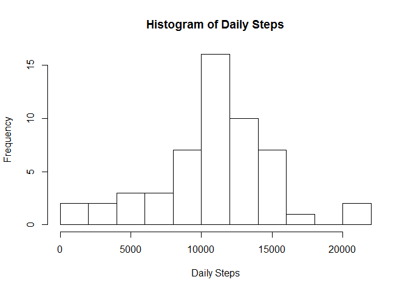
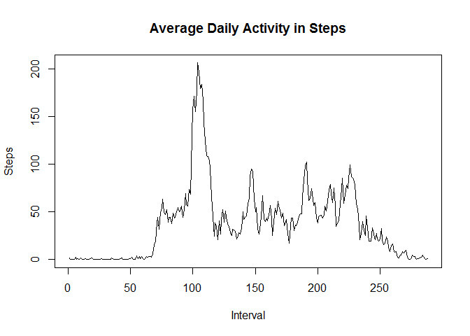
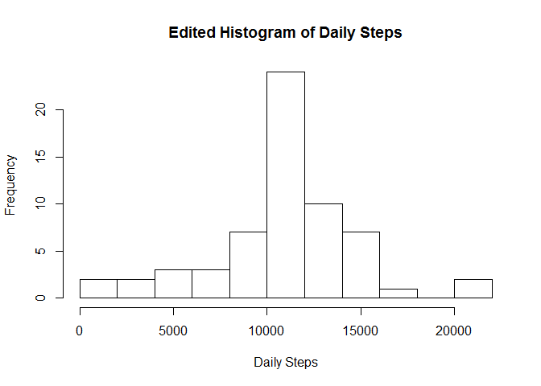
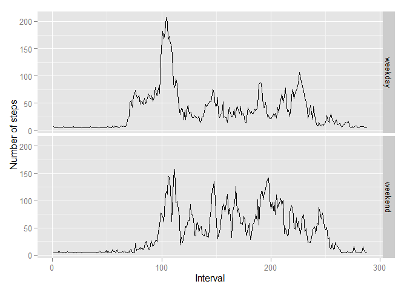

# Reproducible Research: Peer Assessment 1


```r
library(dplyr)
```

```
## 
## Attaching package: 'dplyr'
## 
## The following object is masked from 'package:stats':
## 
##     filter
## 
## The following objects are masked from 'package:base':
## 
##     intersect, setdiff, setequal, union
```

```r
library(knitr)
```


```r
opts_chunk$set(echo=TRUE,results="hide")
```

## Loading and preprocessing the data


```r
data <- read.csv("activity.csv")
dataclean <- na.omit(data)
```

## What is mean total number of steps taken per day?


```r
dailysteps <- tapply(dataclean$steps, dataclean$date,sum)
hist(dailysteps,breaks=10,main="Histogram of Daily Steps",xlab="Daily Steps",ylab="Frequency")
```

 

```r
mean(dailysteps,na.rm=TRUE)
median(dailysteps,na.rm=TRUE)
```

The daily steps average is 10766.19. The median is close at 10765.

## What is the average daily activity pattern?


```r
dataclean$interval <- as.factor(dataclean$interval)
int_avg <- tapply(dataclean$steps,dataclean$interval,mean)
plot(unique(as.numeric(dataclean$interval)),int_avg,type="l",main="Average Daily Activity in Steps",xlab="Interval",ylab="Steps")
```

 


```r
## I sort the values and then grab the final header name.
## Not a very elegant way of doing this, I admit.
as.numeric(names(sort(int_avg)[length(int_avg)]))
```

8:35 a.m has the highest stepping activity, on average. I guess this person takes public transportation to work.

## Inputting missing values


```r
nrow(data) - nrow(dataclean)
```

There are 2304 missing values.


```r
newdata <- data
newdata$steps[is.na(newdata$steps)] <- mean(dataclean$steps)
dailysteps2 <- tapply(newdata$steps, newdata$date,sum)
hist(dailysteps2,breaks=10,main="Edited Histogram of Daily Steps",xlab="Daily Steps",ylab="Frequency")
```

 

```r
mean(dailysteps2,na.rm=TRUE)
median(dailysteps2,na.rm=TRUE)
```

Since I did the easiest (and probably not accurate) substitution imaginable, the mean for total steps per day was not affected at all, and the median was brought right in line with the mean. I would have liked to replace the NAs with the average for each specific interval time, but I did not leave myself enough time to figure out that code.

## Are there differences in activity patterns between weekdays and weekends?


```r
newdata$date <- as.POSIXlt(newdata$date)
newdata$weekdays <- weekdays(newdata$date,abbreviate=T)

newdata$weekdays[newdata$weekdays %in% c("Sun", "Sat")]<-"weekend"
newdata$weekdays[newdata$weekdays %in% c("Mon", "Tue","Wed","Thu","Fri")]<-"weekday"
newdata$weekdays <- as.factor(newdata$weekdays)
```


```r
newdata$date <- as.character(newdata$date)

weekend <- filter(newdata,newdata$weekdays=="weekend")
weekday <- filter(newdata,newdata$weekdays=="weekday")

weekend_agg <- aggregate(steps~interval,data=weekend,match.fun(mean))
weekend_agg$weekday <- "weekend"
weekday_agg <- aggregate(steps~interval,data=weekday,match.fun(mean))
weekday_agg$weekday <- "weekday"

merged <- rbind(weekend_agg,weekday_agg)
merged$weekday <- as.factor(merged$weekday)

library(ggplot2)

merged$interval <- as.factor(merged$interval)
qplot(as.numeric(interval),steps,data=merged,facets=weekday~.,geom="line",xlab="Interval",ylab="Number of steps")
```

 

It seems -- unsurprisingly -- that there is more walking activity on the weekend. That makes sense.
